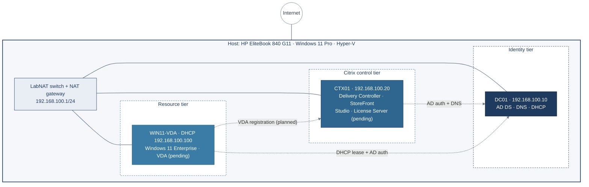

# Citrix Virtual Apps & Desktops Home Lab: Architecture and Build Guide

   

**Author:** Olufemi Joshua Ajala · Cybersecurity & AI Governance · September 2026

**Contents:** [Executive summary](#1-executive-summary) · [Objectives and scope](#2-objectives-and-scope) · [Architecture](#3-solution-architecture) · [Design decisions](#4-key-design-decisions) · [Specification](#5-environment-specification) · [Build](#6-build-implementation) · [Issues](#7-issues-encountered-and-resolutions) · [Security](#8-security-and-governance-considerations) · [Roadmap](#9-current-status-and-roadmap) · [Skills](#10-skills-demonstrated-and-lessons-learned) · [Governance framing](#11-security-and-ai-governance-framing) · [Azure path](#12-cloud-migration-path-microsoft-azure)

---

## 1. Executive summary

> **Status:** Phase 1 (enterprise foundation) complete. Citrix installation phases 7 to 10 are pending access to installation media.

A three-tier, enterprise-style Citrix Virtual Apps and Desktops (CVAD) lab foundation is built and operational on a single laptop, ready for the Citrix software install.

The lab replicates the core of a corporate virtual desktop estate: an Active Directory domain (`lab.local`), a dedicated Citrix infrastructure server, and a Windows 11 virtual desktop. All three virtual machines run on Microsoft Hyper-V on an isolated NAT network, with DNS, DHCP and internet access provided centrally.

| Area | Status |
| --- | --- |
| Host platform and virtual network | Complete |
| Identity tier (DC01: AD DS, DNS, DHCP) | Complete |
| Citrix infrastructure server (CTX01) | Built and domain-joined; Citrix software pending |
| Virtual desktop (WIN11-VDA) | Built and domain-joined; VDA pending |
| Directory design (OUs, users, groups) | Complete |

The one open dependency is download access to the Citrix installation media, which requires an account set up through Citrix sales or a Citrix partner.

---

## 2. Objectives and scope

The goal is a repeatable, self-contained environment for hands-on Citrix training that mirrors how enterprises structure their virtual desktop infrastructure.

**Objectives**

- Build a working Citrix delivery path end to end: identity, brokering, and a virtual desktop.
- Follow enterprise conventions for naming, IP addressing, OU design and group-based access.
- Script post-install configuration in PowerShell so each step is documented and repeatable.
- Keep the lab isolated from the home network while still giving it internet access.

**In scope**

- Hyper-V host configuration and an isolated NAT virtual network.
- One domain controller providing AD DS, DNS and DHCP.
- One Citrix infrastructure server and one Windows 11 desktop VM.
- Active Directory OUs, test users and a Citrix access group.

**Out of scope for this phase**

- High availability (a second controller, SQL clustering, load-balanced StoreFront).
- External access through Citrix NetScaler Gateway.
- Provisioning technologies such as MCS or PVS image management.

**Constraints**

- A single laptop host, so there is no hardware redundancy.
- Evaluation licensing: Windows Server for 180 days, Windows 11 Enterprise for 90 days, and Citrix trial mode for 30 days and 10 connections.

---

## 3. Solution architecture

All three VMs sit on one internal Hyper-V switch, with the host acting as the NAT gateway and DC01 as the single source of identity, name resolution and addressing.



The planned user flow: `citrixuser1` signs in to StoreFront on CTX01, the Delivery Controller authenticates the user against DC01 and checks membership of **Citrix Desktop Users**, then brokers a session to WIN11-VDA.

---

## 4. Key design decisions

Each decision favours a realistic enterprise pattern while keeping the lab simple enough to run on one machine.

| # | Decision | Alternatives considered | Rationale |
| --- | --- | --- | --- |
| D1 | Host capacity sized for the full lab: 64 GB RAM on an HP EliteBook 840 G11 | A 16 GB host extended with RAM and external storage upgrades | 16 GB could not run three VMs comfortably. 64 GB removes memory as a constraint and leaves room to grow |
| D2 | Microsoft Hyper-V as the hypervisor | VMware Workstation | Built into Windows 11 Pro at no cost, fully scriptable in PowerShell, and a supported Citrix hypervisor |
| D3 | Internal switch with NAT (LabNAT) | External switch bridged to the home network | Isolates the lab's DHCP and domain from the home network while keeping internet access |
| D4 | Dedicated 192.168.100.0/24 subnet with a reserved addressing plan | Default Hyper-V switch | Predictable, documented addresses. Servers are static; desktops use a DHCP scope |
| D5 | Separate VMs for identity, Citrix control and desktop | Collapse roles onto fewer VMs | Mirrors enterprise tiering and keeps faults and changes isolated per tier |
| D6 | Single-server Citrix control tier on CTX01 | Split Delivery Controller, StoreFront and SQL | Enough for learning. Can be expanded to HA later |
| D7 | OU design separating Users, Groups, Servers and VDAs | Default Users and Computers containers | Enables targeted Group Policy for servers versus desktops |
| D8 | Group-based access through Citrix Desktop Users | Assigning individual users | Standard least-privilege practice. Access changes become group membership changes |
| D9 | Windows Server 2022 Desktop Experience and Windows 11 Enterprise | Server Core, Windows 11 Pro | GUI suits learning. Enterprise is the edition corporate VDAs typically run |
| D10 | Generation 2 VMs with vTPM on the desktop | Generation 1 | Required for Windows 11 and matches modern UEFI and Secure Boot builds |
| D11 | Domain name lab.local | A subdomain of an owned public domain (e.g. ad.example.com) | Accepted trade-off for an isolated lab. Microsoft advises against .local because it conflicts with multicast DNS; a production design would use a subdomain of a registered domain |

---

## 5. Environment specification

The lab uses about 20 GB of the host's 64 GB RAM, leaving headroom for additional servers.

**Host**

| Attribute | Value |
| --- | --- |
| Model | HP EliteBook 840 G11 |
| CPU | Intel Core Ultra 7 155U (12 cores, 14 threads) |
| Memory | 64 GB DDR5 |
| Storage | 1 TB SSD (single M.2 slot) |
| OS | Windows 11 Pro, Hyper-V role enabled |
| Host name | LAB-HOST01 |

**Virtual machines**

| VM | Role | OS | vCPU | RAM (GB) | Disk (GB) | Generation |
| --- | --- | --- | --- | --- | --- | --- |
| DC01 | AD DS, DNS, DHCP | Windows Server 2022 Standard Eval (Desktop Experience) | 2 | 4 | 60 | 2 |
| CTX01 | Citrix Delivery Controller, StoreFront, Studio, License Server | Windows Server 2022 Standard Eval (Desktop Experience) | 4 | 8 | 80 | 2 |
| WIN11-VDA | Virtual desktop | Windows 11 Enterprise Eval 25H2 | 2 | 8 | 80 | 2 (vTPM) |

**IP addressing**

| Address | Assignment |
| --- | --- |
| 192.168.100.0/24 | Lab subnet |
| 192.168.100.1 | Host vEthernet (LabNAT), default gateway |
| 192.168.100.10 | DC01, static |
| 192.168.100.20 | CTX01, static |
| 192.168.100.100–150 | DHCP scope "Lab" for desktops (WIN11-VDA leased .100) |
| DNS forwarders | 8.8.8.8, 1.1.1.1 |

**Active Directory**

| Object | Value |
| --- | --- |
| Forest and domain | lab.local (NetBIOS: LAB) |
| OU=Lab | Parent OU |
| OU=Users,OU=Lab | citrixuser1, citrixuser2 |
| OU=Groups,OU=Lab | Citrix Desktop Users (Global security group) |
| OU=Servers,OU=Lab | CTX01 |
| OU=VDAs,OU=Lab | WIN11-VDA |
| OU=Domain Controllers | DC01 |

---

## 6. Build implementation

The build ran in six phases, each ending with a verification check. A Hyper-V checkpoint of all three VMs captures the completed foundation. Commands marked **Host** run in an elevated PowerShell on the laptop, and the others run inside the named VM.

### Phase 1: Host platform (Host)

```powershell
Enable-WindowsOptionalFeature -Online -FeatureName Microsoft-Hyper-V -All
New-Item -ItemType Directory -Path C:\Lab\ISOs, C:\Lab\VMs -Force
```

Media staged in `C:\Lab\ISOs`: `SERVER_EVAL_x64FRE_en-us.iso` (Windows Server 2022) and `Win11_Ent_Eval.iso` (Windows 11 Enterprise 25H2).

**Verified:** Hyper-V Manager opens and lists the host.

### Phase 2: Isolated NAT network (Host)

```powershell
New-VMSwitch -Name "LabNAT" -SwitchType Internal
New-NetIPAddress -IPAddress 192.168.100.1 -PrefixLength 24 -InterfaceAlias "vEthernet (LabNAT)"
New-NetNat -Name "LabNAT" -InternalIPInterfaceAddressPrefix 192.168.100.0/24
```

**Verified:** `Get-NetNat` shows LabNAT, 192.168.100.0/24, Active: True.

### Phase 3: DC01, the identity tier

Create the VM (Host):

```powershell
New-VM -Name DC01 -Generation 2 -MemoryStartupBytes 4GB -Path C:\Lab\VMs -NewVHDPath C:\Lab\VMs\DC01\DC01.vhdx -NewVHDSizeBytes 60GB -SwitchName LabNAT
Set-VMProcessor DC01 -Count 2
Add-VMDvdDrive -VMName DC01 -Path "C:\Lab\ISOs\SERVER_EVAL_x64FRE_en-us.iso"
Set-VMFirmware DC01 -FirstBootDevice (Get-VMDvdDrive DC01)
```

Install Windows Server 2022 Standard Evaluation (Desktop Experience), then configure it (DC01):

```powershell
New-NetIPAddress -InterfaceAlias Ethernet -IPAddress 192.168.100.10 -PrefixLength 24 -DefaultGateway 192.168.100.1
Set-DnsClientServerAddress -InterfaceAlias Ethernet -ServerAddresses 127.0.0.1
Rename-Computer -NewName DC01 -Restart
Install-WindowsFeature AD-Domain-Services, DNS, DHCP -IncludeManagementTools
Install-ADDSForest -DomainName lab.local -DomainNetbiosName LAB -InstallDns
Add-DnsServerForwarder -IPAddress 8.8.8.8, 1.1.1.1
Add-DhcpServerInDC -DnsName dc01.lab.local -IPAddress 192.168.100.10
Add-DhcpServerv4Scope -Name Lab -StartRange 192.168.100.100 -EndRange 192.168.100.150 -SubnetMask 255.255.255.0
Set-DhcpServerv4OptionValue -ScopeId 192.168.100.0 -Router 192.168.100.1 -DnsServer 192.168.100.10 -DnsDomain lab.local
Restart-Service DHCPServer
```

**Verified:** `ping 8.8.8.8` gets replies, `Get-ADDomain` returns lab.local / LAB, `whoami` returns lab\administrator, `Resolve-DnsName google.com` resolves, and the Lab DHCP scope is Active.

### Phase 4: CTX01, the Citrix control tier

Create the VM (Host). It follows the same pattern as DC01, with 8 GB RAM, an 80 GB disk and 4 vCPU:

```powershell
New-VM -Name CTX01 -Generation 2 -MemoryStartupBytes 8GB -Path C:\Lab\VMs -NewVHDPath C:\Lab\VMs\CTX01\CTX01.vhdx -NewVHDSizeBytes 80GB -SwitchName LabNAT
Set-VMProcessor CTX01 -Count 4
```

Configure it and join the domain (CTX01):

```powershell
New-NetIPAddress -InterfaceAlias Ethernet -IPAddress 192.168.100.20 -PrefixLength 24 -DefaultGateway 192.168.100.1
Set-DnsClientServerAddress -InterfaceAlias Ethernet -ServerAddresses 192.168.100.10
Add-Computer -DomainName lab.local -NewName CTX01 -Credential LAB\Administrator -Restart
```

**Verified:** `ping lab.local` resolves to 192.168.100.10, the computer's domain shows lab.local, and a domain sign-in returns lab\administrator.

### Phase 5: WIN11-VDA, the resource tier

Create the VM with a virtual TPM for Windows 11 (Host):

```powershell
New-VM -Name WIN11-VDA -Generation 2 -MemoryStartupBytes 8GB -Path C:\Lab\VMs -NewVHDPath C:\Lab\VMs\WIN11-VDA\WIN11-VDA.vhdx -NewVHDSizeBytes 80GB -SwitchName LabNAT
Set-VMProcessor WIN11-VDA -Count 2
Set-VMKeyProtector -VMName WIN11-VDA -NewLocalKeyProtector
Enable-VMTPM -VMName WIN11-VDA
Add-VMDvdDrive -VMName WIN11-VDA -Path C:\Lab\ISOs\Win11_Ent_Eval.iso
Set-VMFirmware WIN11-VDA -FirstBootDevice (Get-VMDvdDrive WIN11-VDA)
```

Install Windows 11 Enterprise with a local account (**Sign-in options → Domain join instead**), then join the domain (WIN11-VDA):

```powershell
Add-Computer -DomainName lab.local -NewName WIN11-VDA -Credential LAB\Administrator -Restart
```

**Verified:** `ipconfig /all` shows a DHCP lease of 192.168.100.100 from DC01 with the lab.local suffix, and `whoami` returns lab\administrator.

### Phase 6: Directory structure and access (DC01)

```powershell
New-ADOrganizationalUnit -Name Lab
"Users","Groups","Servers","VDAs" | ForEach-Object { New-ADOrganizationalUnit -Name $_ -Path "OU=Lab,DC=lab,DC=local" }
$pw = Read-Host "Enter password" -AsSecureString
1..2 | ForEach-Object { New-ADUser -Name "citrixuser$_" -UserPrincipalName "citrixuser$_@lab.local" -Path "OU=Users,OU=Lab,DC=lab,DC=local" -AccountPassword $pw -Enabled $true }
New-ADGroup -Name "Citrix Desktop Users" -GroupScope Global -Path "OU=Groups,OU=Lab,DC=lab,DC=local"
Add-ADGroupMember "Citrix Desktop Users" -Members citrixuser1, citrixuser2
Get-ADComputer CTX01 | Move-ADObject -TargetPath "OU=Servers,OU=Lab,DC=lab,DC=local"
Get-ADComputer WIN11-VDA | Move-ADObject -TargetPath "OU=VDAs,OU=Lab,DC=lab,DC=local"
```

**Verified:** all five OUs exist, both users are Enabled, the group has two members, and each computer sits in its OU.

### Checkpoints (Host)

```powershell
Get-VM | Checkpoint-VM -SnapshotName "Lab foundation complete"
```

---

## 7. Issues encountered and resolutions

Nine issues came up during the build, and none required rebuilding a VM. Each was diagnosed from the error text and fixed in place.

| # | Issue | Root cause | Resolution |
| --- | --- | --- | --- |
| 1 | `New-NetNat` failed with Windows System Error 52 (duplicate name) | The LabNAT NAT object already existed from an earlier run | Confirmed with `Get-NetNat` that it was correct and Active. No change needed |
| 2 | VM boot summary: "SCSI DVD – The boot loader failed" | The "Press any key to boot from CD or DVD" prompt timed out | Reset the VM and pressed a key immediately |
| 3 | Restart button unresponsive on the boot summary screen | VMConnect focus | Used Action → Reset, or `Stop-VM -TurnOff` then `Start-VM` |
| 4 | Pasted commands merged, e.g. `Get-NetAdapterNew-NetIPAddress` | Clipboard paste appended to the previous line | Cleared the line and re-entered the command on its own |
| 5 | Long commands truncated inside VMConnect | Likely paste-length limits in the VM console (not confirmed) | Typed commands by hand and dropped unnecessary quotes |
| 6 | `vmconnect` not recognised | Run inside DC01 instead of on the host | Ran Hyper-V cmdlets in the host's elevated PowerShell only |
| 7 | Rename-Item could not find the Windows 11 ISO | Tab completion not used on a very long filename | Used a wildcard: `Get-ChildItem C:\Lab\ISOs\26200*.iso \| Rename-Item -NewName Win11_Ent_Eval.iso` |
| 8 | `New-ADUser` rejected the password, leaving both users created but disabled | Password did not meet domain complexity policy | Reset with `Set-ADAccountPassword -Reset` and `Enable-ADAccount` |
| 9 | CTX01 signed in as ctx01\administrator after the domain join | The local account is the default at the sign-in screen | Signed in via Other user as LAB\Administrator |

A tenth blocker is still open: the Citrix installation media. Citrix no longer offers self-service account creation for trials, so an account must be provisioned through Citrix sales or a partner.

---

## 8. Security and governance considerations

The lab applies baseline controls now and flags the hardening a production build would need.

**Controls in place**

- **Network isolation:** the lab runs on an internal switch behind NAT, so its DHCP and domain services never reach the home network.
- **Least privilege by group:** desktop access will be granted through the Citrix Desktop Users security group, not to individual accounts.
- **Structured directory:** separate OUs for servers and desktops allow distinct Group Policy baselines.
- **Password policy:** the default domain complexity policy is enforced. It rejected a weak password during the build, as intended.
- **Secure Boot and vTPM:** Generation 2 VMs with UEFI Secure Boot, and a virtual TPM on the Windows 11 desktop.
- **Recoverability:** a Hyper-V checkpoint of all three VMs at the end of the foundation build allows rollback in seconds.

**Gaps a production design would close**

- **Privileged access:** the built-in Administrator is used everywhere. Production would use named admin accounts, tiered administration and a separate Citrix admin group.
- **Service accounts:** none yet. Citrix and SQL would run under dedicated or group Managed Service Accounts.
- **Resilience:** there is a single domain controller and a single Citrix controller, so each is a single point of failure.
- **TLS:** StoreFront will need a certificate (from an internal CA) rather than HTTP.
- **Monitoring and logging:** no central log collection or Citrix Director monitoring yet.
- **Backup:** checkpoints are not backups. Production needs system-state backups of the domain controllers.

These gaps also map to ISO/IEC 27001 Annex A areas such as access control, logging and monitoring, and backup, which makes the lab useful for demonstrating control design as well as technical build.

---

## 9. Current status and roadmap

The foundation (phases 1 to 6) is complete, and the Citrix phases start as soon as the installation media is available.

| Phase | Scope | Dependency | Status |
| --- | --- | --- | --- |
| 1–6 | Host, network, DC01, CTX01, WIN11-VDA, AD structure | None | Complete |
| 7 | Install the Delivery Controller, Studio, StoreFront and License Server on CTX01 | Citrix CVAD ISO (LTSR) | Blocked: awaiting Citrix account |
| 8 | Install the VDA on WIN11-VDA and register it with CTX01 | Phase 7 | Not started |
| 9 | Create a machine catalog and a delivery group assigned to Citrix Desktop Users | Phase 8 | Not started |
| 10 | End-user test: citrixuser1 signs in through StoreFront and launches the desktop | Phase 9 | Not started |
| 11 | Extensions: server VDA for published apps, second controller, TLS, Group Policy baselines, Citrix Director | Phase 10 | Planned |

**Open action**

- [ ] Request a Citrix trial account through Citrix sales or a UK Citrix partner, then download the Citrix Virtual Apps and Desktops LTSR ISO to `C:\Lab\ISOs`.

**Licensing clock:** Citrix trial mode runs for 30 days, so plan phases 7 to 10 into a focused block once the media arrives. Windows Server evaluation lasts 180 days and Windows 11 Enterprise evaluation 90 days.

---

## 10. Skills demonstrated and lessons learned

The project shows end-to-end infrastructure design and delivery, from capacity planning through to a documented, verified build.

**Skills demonstrated**

- **Capacity planning:** sized three VMs against host RAM and chose to replace the host rather than upgrade an undersized one.
- **Virtualisation:** Hyper-V switching, NAT, Generation 2 VMs, vTPM and checkpoints, all scripted in PowerShell.
- **Network design:** subnetting, a static-versus-DHCP addressing plan, gateway and DNS forwarding.
- **Identity services:** building an AD DS forest, integrated DNS, authorised DHCP, domain joins, OU design and group-based access.
- **Troubleshooting:** diagnosed nine issues from error output and fixed each without a rebuild.
- **Documentation:** architecture, design decisions, configuration and verification recorded as the build progressed.

**Lessons learned**

- Know which shell you're in: host cmdlets such as `New-VM` and `vmconnect` fail inside a guest, and guest network commands would reconfigure the host.
- Read errors before retrying. A "duplicate name" error on NAT meant the work was already done.
- A failed `New-ADUser` password can leave a disabled account behind, so always verify rather than assume.
- Point member servers' DNS at the domain controller, not a public resolver, or domain joins fail.
- Check vendor licensing and media access early. It became the critical-path dependency for this project.

---

## 11. Security and AI governance framing

This is an access-control project delivered as infrastructure. Virtual desktop infrastructure exists to put a controlled boundary between a user and the data they work with, so every design decision here is a security decision.

**The security case**

- **Identity as the control plane:** access is granted through a security group, so entitlement reviews become group membership reviews rather than per-machine checks.
- **Segmentation:** the lab runs on an isolated NAT network, demonstrating how a virtual desktop estate is kept off the corporate flat network.
- **Tiered administration:** separate OUs for servers and desktops are the foundation for distinct policy baselines and administrative scoping.
- **Hardware root of trust:** Secure Boot and virtual TPM on the desktop tier support disk encryption and measured boot.
- **Control assessment, not just build:** section 8 states both the controls implemented and the gaps a production design would close, which is the assessment a consultant is engaged to produce.

**ISO/IEC 27001:2022 Annex A mapping**

| Annex A control | Where it appears in this build |
| --- | --- |
| A.5.15 Access control | Citrix Desktop Users group governs desktop entitlement |
| A.5.16 Identity management | User and computer identities provisioned into a structured OU hierarchy |
| A.5.18 Access rights | Group-based assignment, reviewable and revocable in one place |
| A.8.2 Privileged access rights | Gap identified: shared built-in Administrator, with named admin accounts and tiering as the remediation |
| A.8.9 Configuration management | Post-install configuration scripted in PowerShell and documented with verification steps |
| A.8.13 Information backup | Gap identified: checkpoints are not backups, so system-state backup is required |
| A.8.15 Logging | Gap identified: no central log collection or session monitoring |
| A.8.16 Monitoring activities | Planned: Citrix Director for session and performance monitoring |
| A.8.20 Networks security | Isolated internal switch behind NAT |
| A.8.22 Segregation of networks | Lab subnet segregated from the host network |
| A.8.24 Use of cryptography | Gap identified: StoreFront requires TLS from an internal certificate authority |

**Extension: governed access to GenAI tools (ISO/IEC 42001)**

The natural next phase publishes a GenAI application as a Citrix-delivered resource rather than installing it on endpoints. That pattern addresses a live enterprise problem: staff using AI tools outside any control boundary.

Delivering AI tools this way provides:

- **Entitlement control:** access granted to an approved group, with joiners and leavers handled through existing identity processes.
- **Data boundary:** the session runs in the data centre, so corporate data need not leave the controlled environment and clipboard, drive-mapping and print redirection can be restricted by policy.
- **Auditability:** session recording and logging give evidence of who used which AI tool and when.
- **Change control:** the tool version is managed in the master image rather than on individual devices.

This supports ISO/IEC 42001 Clause 8 (Operation) and Clause 9.1 (Monitoring, measurement, analysis and evaluation), together with the Annex A control areas for use of AI systems (A.9) and third-party relationships (A.10), and it turns the lab from a virtualisation exercise into a demonstrable AI governance capability.

---

## 12. Cloud migration path: Microsoft Azure

This lab is deliberately built on-premises on Hyper-V. The value of the design is that its identity and access model is platform-independent: the same structure carries into Azure, and only the hosting layer changes. This section sets out how each component would translate.

**Component mapping**

| Lab component | Azure equivalent | Design note |
| --- | --- | --- |
| DC01 (AD DS, DNS) | Domain controllers on Azure VMs, or Microsoft Entra Domain Services | Citrix VDAs still need a traditional AD domain to join; Entra ID is synchronised via Entra Connect for cloud sign-in |
| DC01 (DHCP) | Azure-native IP addressing | Azure VNets assign addresses themselves, so DHCP is retired rather than migrated |
| CTX01 (Delivery Controller, Studio, Licensing) | Citrix DaaS control plane | The control tier becomes a Citrix-managed service; Cloud Connectors on Azure VMs link it to the domain |
| CTX01 (StoreFront) | Citrix Workspace, or StoreFront on an Azure VM | Workspace removes a server to patch; self-hosted StoreFront keeps more control |
| WIN11-VDA | Citrix VDAs on Azure VMs, or Azure Virtual Desktop session hosts | Windows 11 multi-session is available on Azure, improving density versus one user per VM |
| LabNAT internal switch | Azure Virtual Network with subnets and Network Security Groups | Separate subnets for identity, control and desktop tiers, with NSGs enforcing traffic between them |
| NAT to the internet | Azure NAT Gateway or Azure Firewall | Firewall adds outbound filtering and logging, supporting the monitoring gaps in section 8 |
| Hyper-V checkpoints | Azure Backup and image versioning via Azure Compute Gallery | Closes the backup gap identified against A.8.13 |

**What carries over unchanged**

- The OU structure separating servers, desktops, users and groups.
- Group-based entitlement through Citrix Desktop Users.
- The three-tier separation of identity, control and workload.
- The security gaps and remediations identified in sections 8 and 11.

**What improves in Azure**

- **Conditional Access and MFA** through Entra ID, closing the authentication gap without extra infrastructure.
- **Central logging** through Azure Monitor and Microsoft Sentinel.
- **Elastic capacity**, with desktops scaled by schedule or demand rather than fixed hardware.

**Scope note**

This section is a design mapping, not a deployed build. The lab validates the identity and access design hands-on; an Azure deployment of the same design is a candidate future phase.
